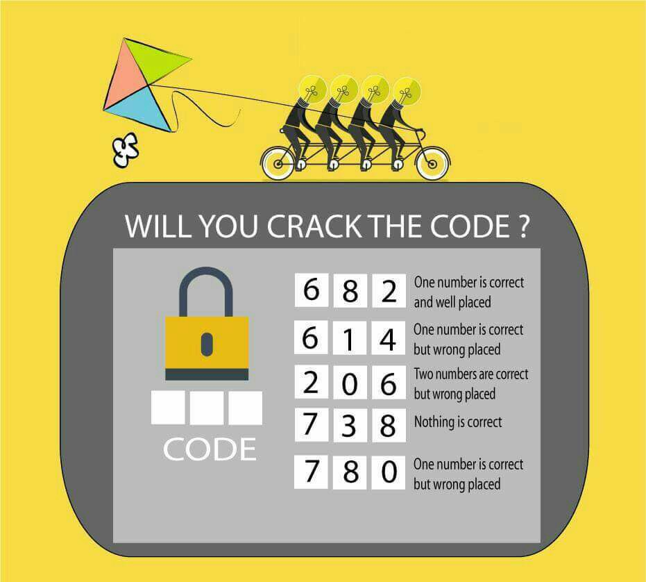

# csp-solver
A linear C++17-compliant solution to a common variant of Constraint Satisfaction Problems (CSP).

## Objective
The program aims to solve a common variant of CSP colloquially known as "Crack the Lock" or "Crack the Code", an example of which could be found [here](https://puzzling.stackexchange.com/questions/46871/crack-the-lock-code).



## Usage
You are only required to modify the following 2 sections in `src/main.cpp`:

```cpp
/* Modify this section for length (the number of digits) */
static constexpr std::size_t N = 3;
```

```cpp
    constexpr auto solution = ext::CreateSolution<char, N> (
        /* Modify this section for constraints */
        /* Constraint<I, Cond> {{ "Comb" }} means that for combination Comb, I digit(s) are Cond */
        /* For example, the first constraint (described by the one right below) means for combination "682", 1 digit is correct and correctly placed */
        Constraint<1, ext::MatchCondition::kCorrectValCorrectPos> {{ "682" }},
        Constraint<1, ext::MatchCondition::kCorrectValWrongPos> {{ "614" }},
        Constraint<2, ext::MatchCondition::kCorrectValWrongPos> {{ "206" }},
        Constraint<3, ext::MatchCondition::kWrongValWrongPos> {{ "738" }},
        Constraint<1, ext::MatchCondition::kCorrectValWrongPos> {{ "780" }}
    );
```

## Build and run
```sh
$ g++ -std=c++17 src/main.cpp -o csp
$ ./csp.exe
With 5 constraints:
(1) 682: 1 digit is correct and correctly placed.
(2) 614: 1 digit is correct but incorrectly placed.
(3) 206: 2 digits are correct but incorrectly placed.
(4) 738: 3 digits are incorrect (value-wise and position-wise).
(5) 780: 1 digit is correct but incorrectly placed.
Found 1 matching combinations:
042 
(generated within compile-time, printed in 3724ms)
```
